# Guide Coin229 — Espace admin & espace vendeur

Guide pratique avec captures prises sur la prod (`https://coin229.vercel.app`), septembre 2026.

| Rôle | URL | Accès |
|------|-----|--------|
| Admin (back-office) | `/admin/login` | Mot de passe admin (`ADMIN_PASSWORD`) |
| Vendeur | `/vendeur/login` | Email + mot de passe marque |
| Inscription vendeur | `/vendeur/inscription` | Compte créé en `en_attente` jusqu’à validation admin |

---

## 1. Espace admin (back-office)

Thème sombre vert. Sidebar : Tableau de bord · Produits · Commandes · Vendeurs · Reversements · Notifications.

### 1.1 Connexion

1. Ouvre `https://coin229.vercel.app/admin/login`
2. Saisis le mot de passe admin
3. Clique **Entrer**

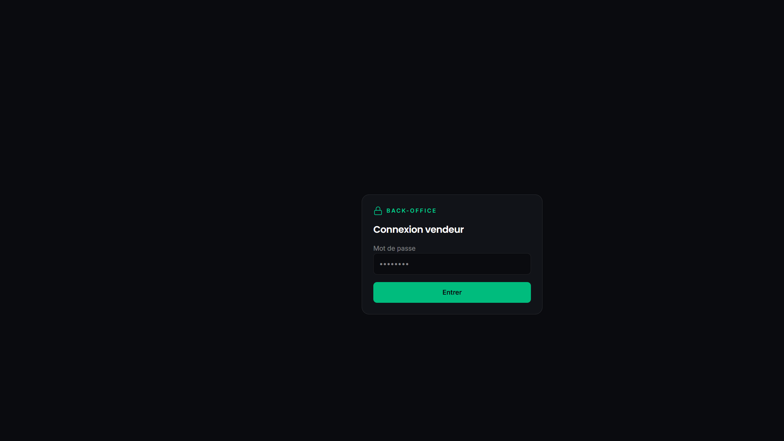

### 1.2 Tableau de bord

Vue d’ensemble : nombre de produits, commandes (dont en attente), volume FCFA. Raccourcis vers produits, commandes et validation vendeurs.

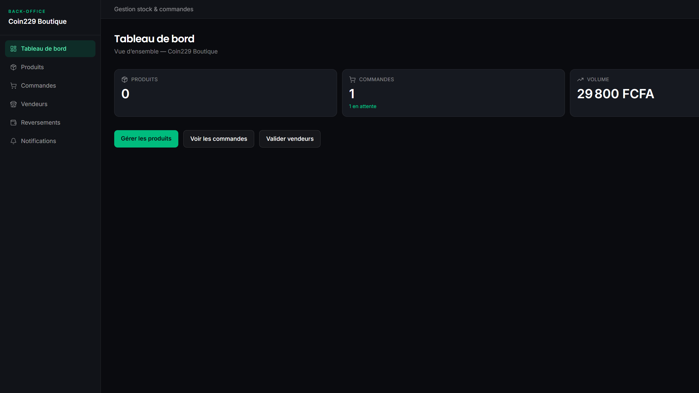

**À faire au quotidien :** vérifier les commandes « En attente », puis les vendeurs à activer.

### 1.3 Produits

Catalogue plateforme (stock / tarifs). Bouton **+ Ajouter** pour créer un produit côté boutique Coin229.

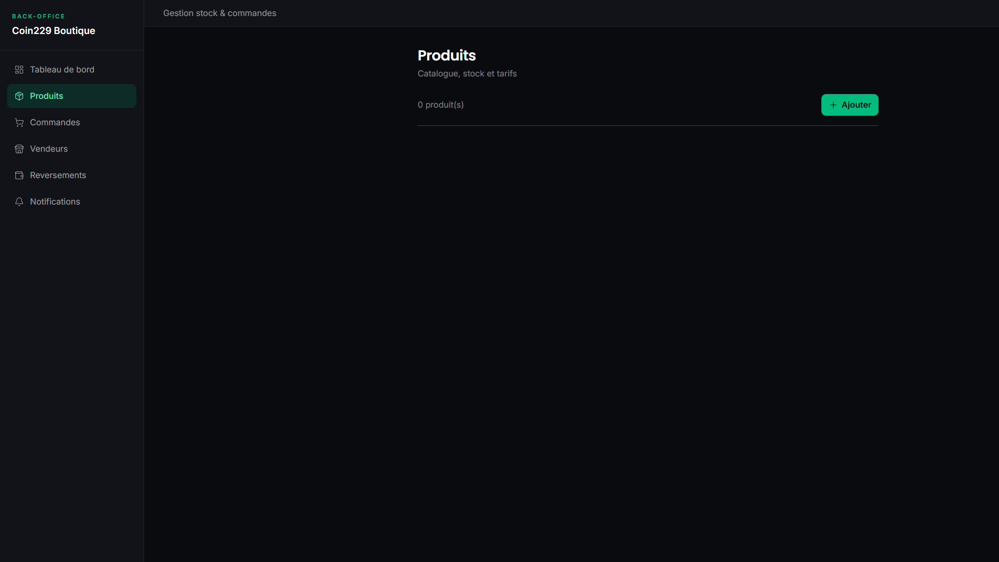

> Les catalogues des marques marketplace se gèrent surtout dans l’espace vendeur. L’admin voit surtout le stock « Coin229 Boutique ».

### 1.4 Commandes

Suivi client + changement de statut :

`En attente` → `Confirmée` → `En livraison` → `Livrée` (ou `Annulée`)

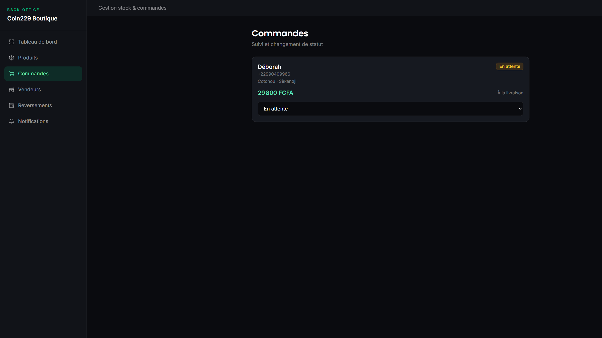

**Conseil :** après passage en **Livrée**, le montant entre dans le calcul de reversement vendeur (commission plateforme).

### 1.5 Vendeurs

Liste des marques : email, téléphone, slug vitrine, nb produits / commandes, statut.

- **Activer** un compte `en_attente` (après inscription)
- **Suspendre** une marque problématique

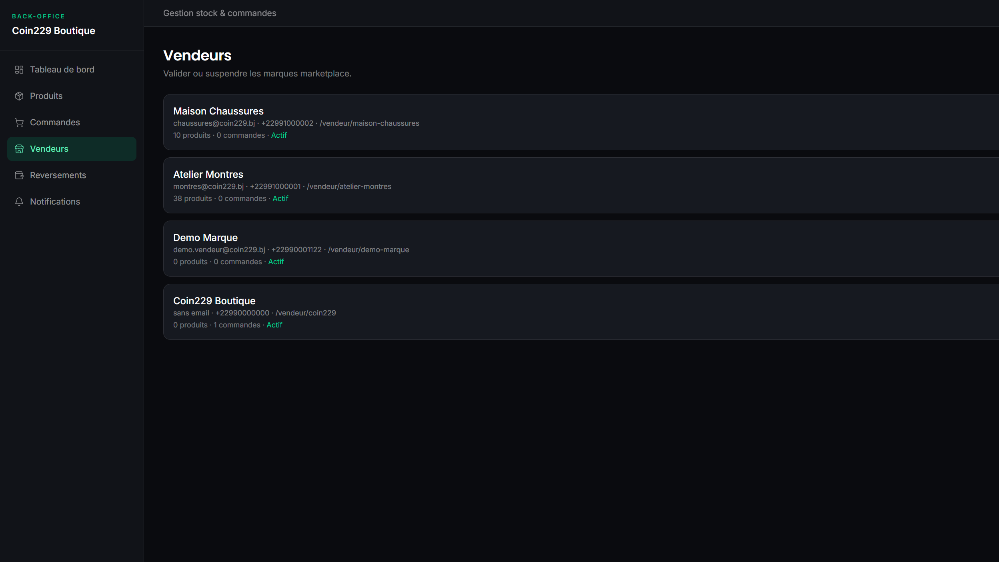

### 1.6 Reversements

Marquer les reversements manuels (Mobile Money / virement) vers les vendeurs après commandes livrées.

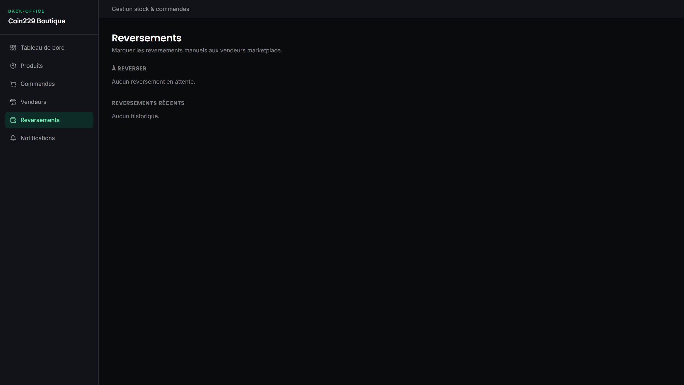

### 1.7 Notifications push

Envoyer une alerte aux visiteurs abonnés (Web Push). Remplir titre, message, lien (`/boutique`…) puis **Envoyer à tous les abonnés**.

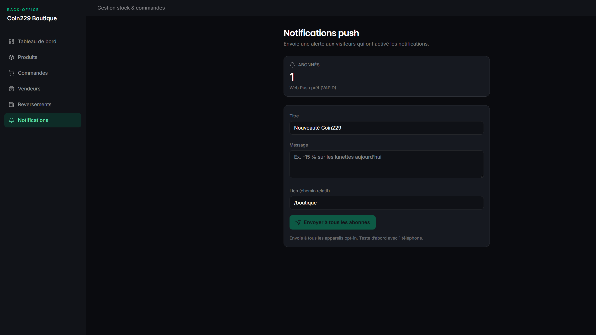

**Règle :** tester d’abord sur **1 téléphone** avant un envoi large.

---

## 2. Espace vendeur

Thème sombre orange. Sidebar : Tableau de bord · Produits · Commandes · Messages · Finances · Profil · Liens pub.

### 2.1 Inscription (nouvelle marque)

1. Ouvre `/vendeur/inscription`
2. Remplis boutique, email, mot de passe, WhatsApp
3. **Créer mon compte**
4. Attends l’activation par un admin Coin229 (compte en attente au départ)

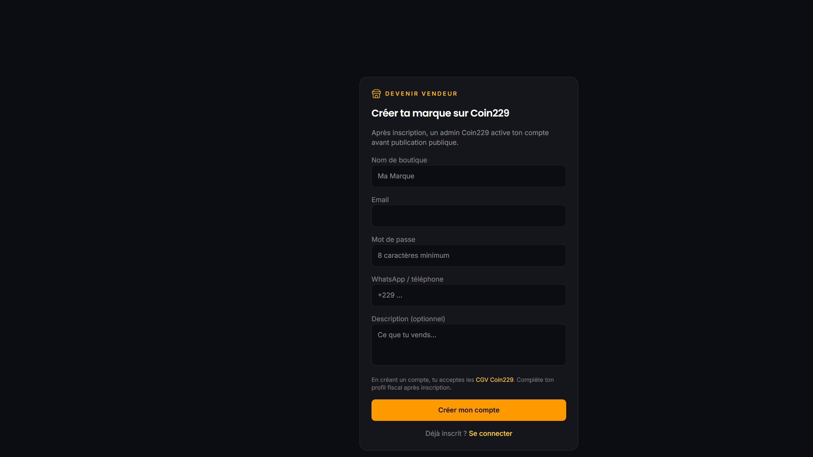

### 2.2 Connexion

1. `/vendeur/login`
2. Email + mot de passe
3. **Se connecter** (lien « Mot de passe oublié ? » si besoin)

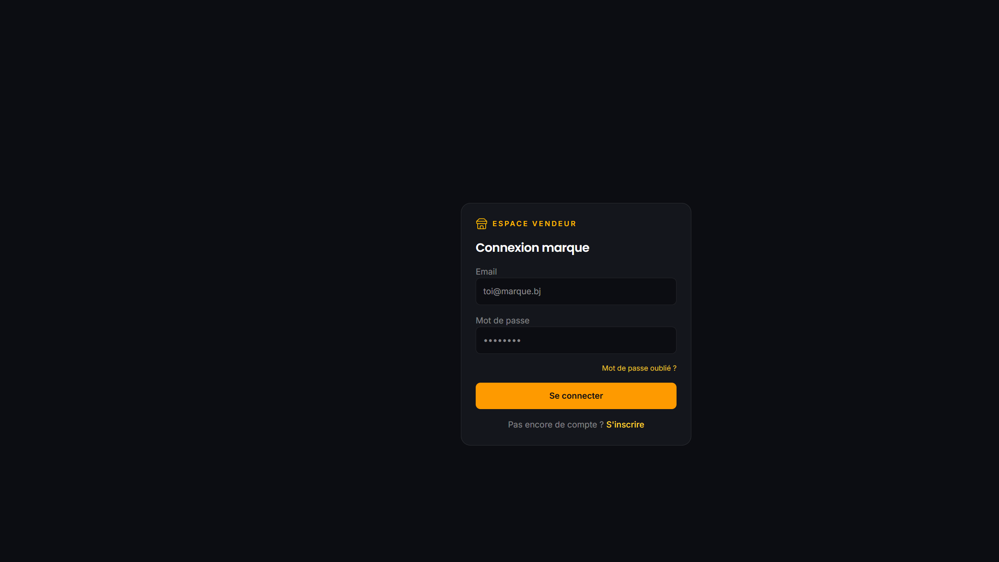

### 2.3 Tableau de bord

Résumé produits / commandes / volume, rappel de partager la vitrine (WhatsApp / TikTok).

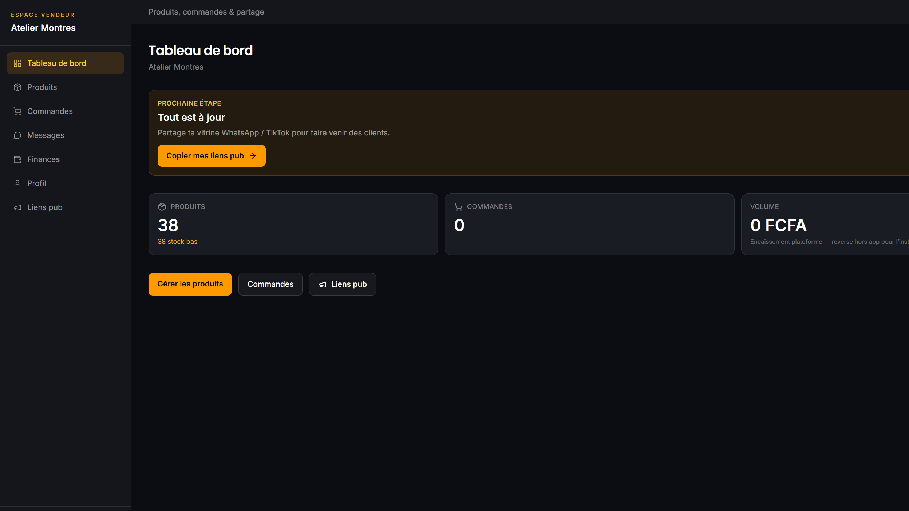

### 2.4 Produits — catalogue

Liste de tes articles (photo, niche, prix, stock). Bouton **Ajouter** pour publier.

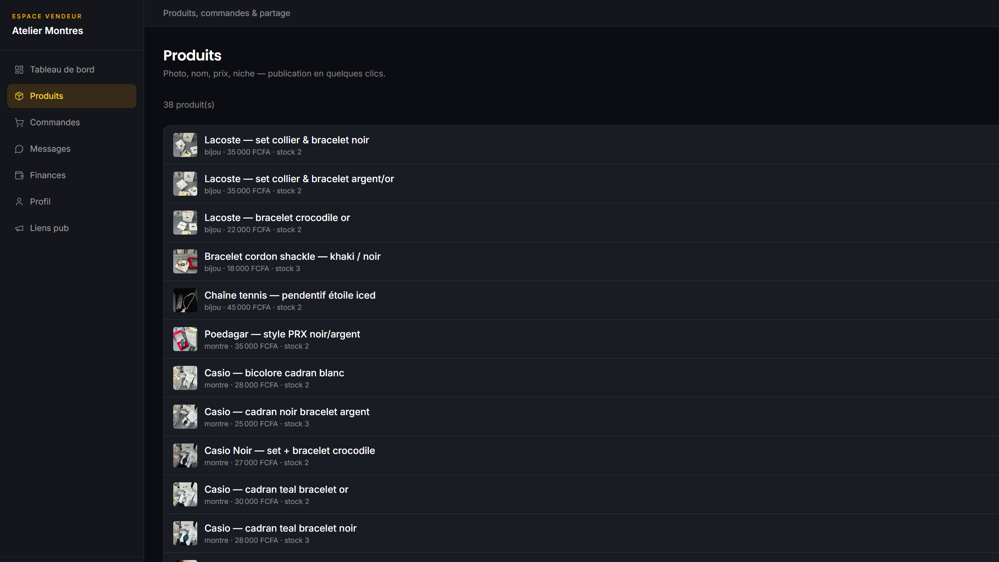

### 2.5 Produits — ajouter en 4 étapes

1. **Ajouter des photos**
2. Nom (+ description courte optionnelle)
3. Niche (Montres luxe, Bijoux, Sandales…)
4. Prix FCFA + stock → **Enregistrer**

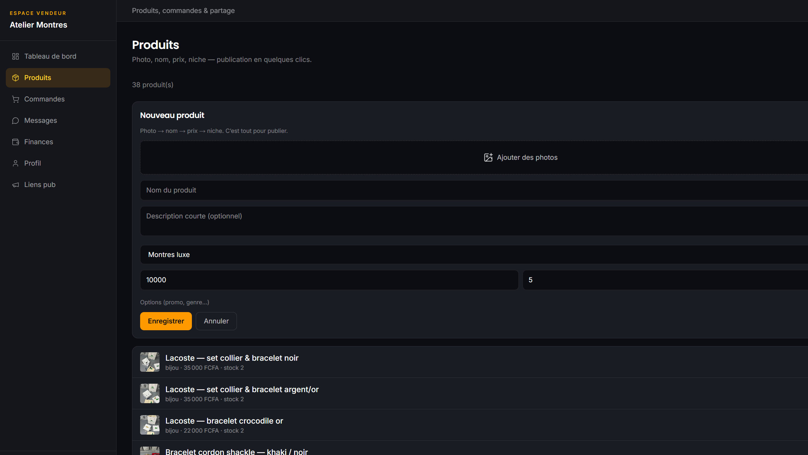

### 2.6 Commandes

Uniquement les commandes de **ta** marque (pas celles des autres vendeurs ni du catalogue admin).

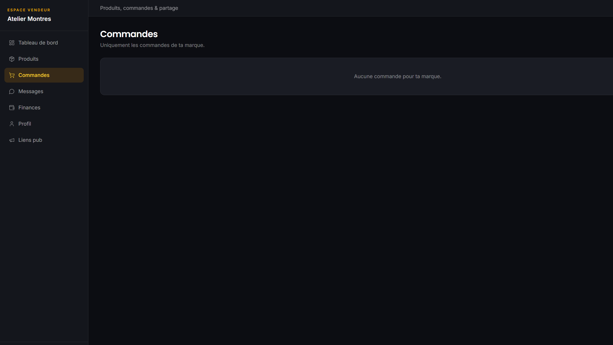

### 2.7 Messages

Discussions clients initiées depuis la fiche produit / vitrine.

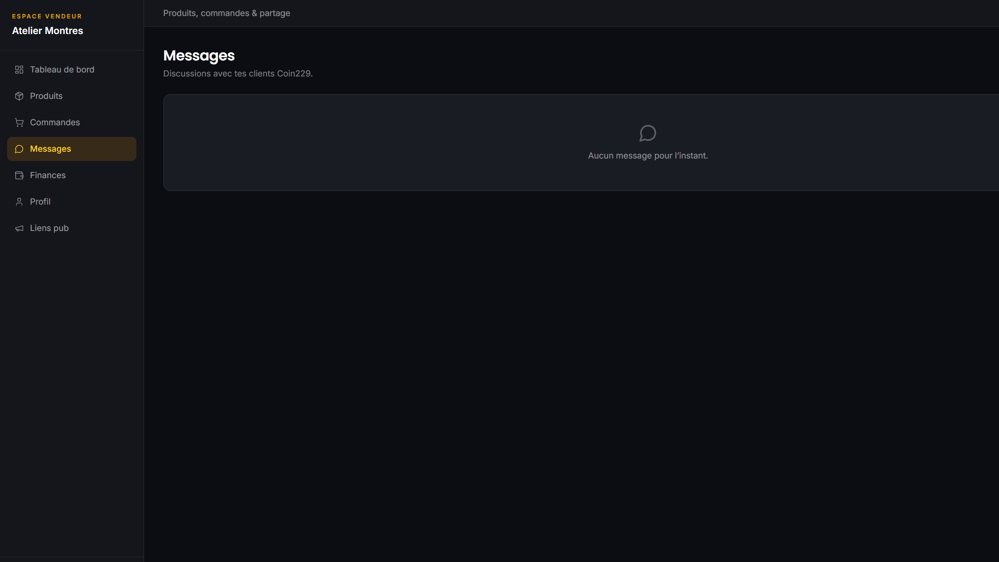

### 2.8 Finances

Commission plateforme (ex. 10 %), CA brut, net vendeur, montant en attente de reversement Coin229.

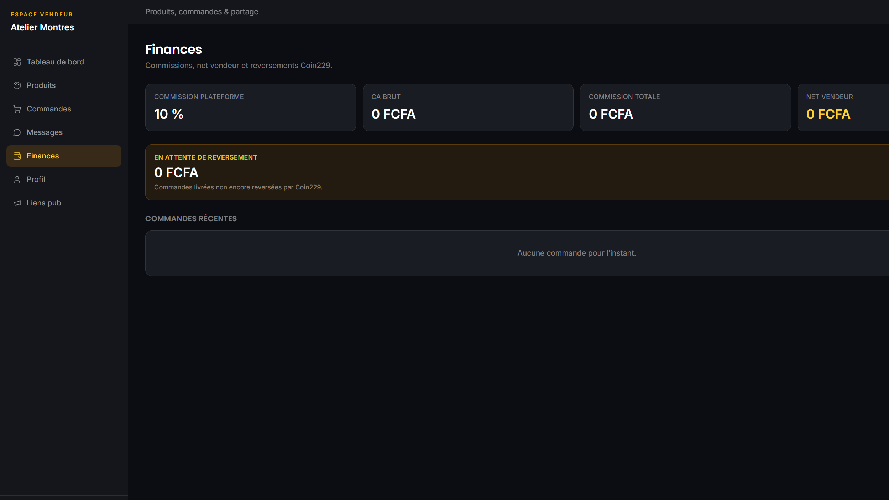

### 2.9 Profil marque

Description publique, contact WhatsApp, logo, IFU / RCCM (optionnel), Mobile Money pour les reversements. Accepte les CGV vendeur puis **Enregistrer le profil**.

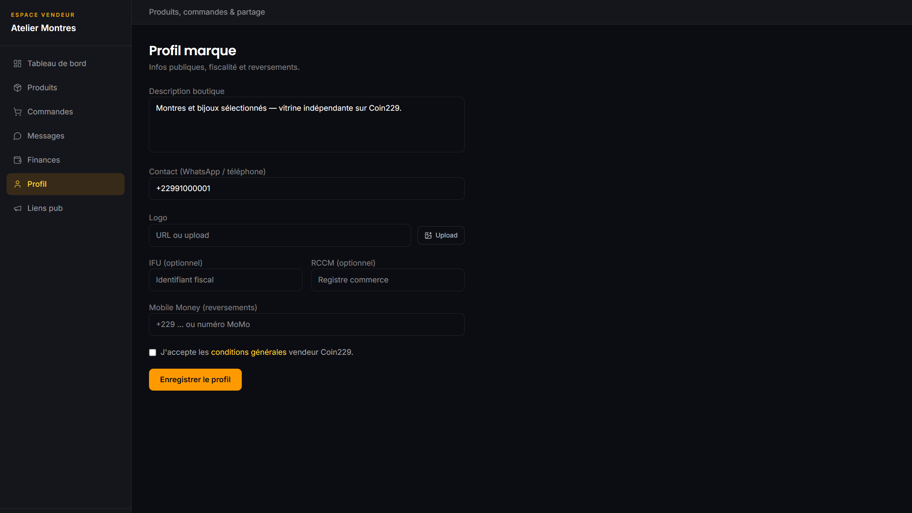

### 2.10 Liens pub

- Lien vitrine : `/vendeur/ton-slug`
- Liens produits avec UTM (`source=vendor`…) pour WhatsApp / Facebook / TikTok

Copie → colle dans ta story / statut. Le trafic revient sur Coin229.

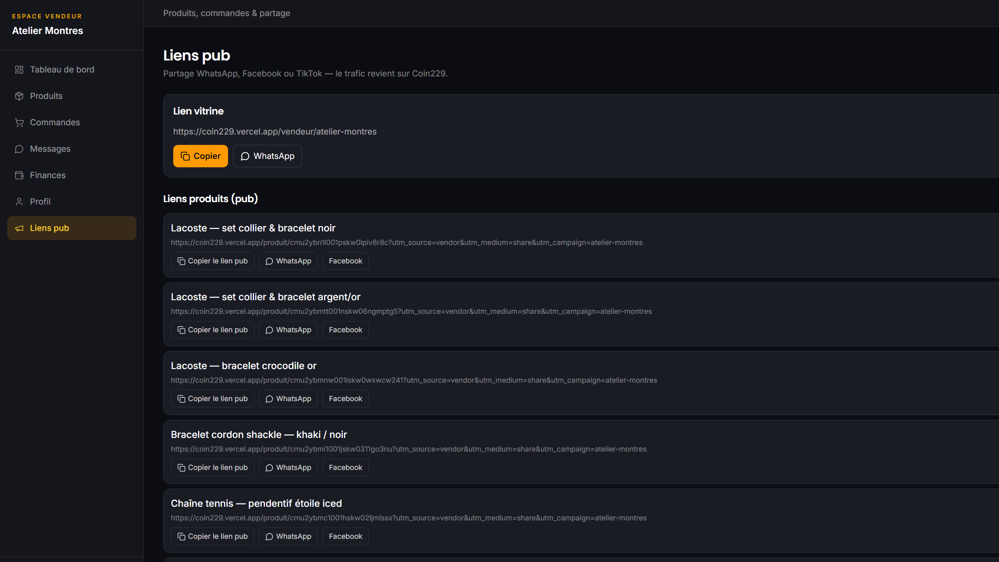

---

## 3. Parcours recommandés

### Admin — nouvelle commande

1. `/admin/commandes` → vérifier téléphone & zone
2. Appeler / WhatsApp client si besoin
3. Statut **Confirmée** puis **En livraison** puis **Livrée**
4. Si commande marketplace : noter le reversement dans `/admin/payouts` après paiement vendeur

### Admin — nouveau vendeur

1. Notification / demande d’inscription
2. `/admin/vendeurs` → **Activer**
3. Vérifier Profil (IFU/RCCM/MoMo) côté vendeur

### Vendeur — publier & vendre

1. Connexion → **Produits** → ajouter photos + prix
2. **Liens pub** → partager WhatsApp
3. Suivre **Commandes** et **Messages**
4. Consulter **Finances** pour le net après commission

---

## 4. Différences utiles

| | Admin | Vendeur |
|--|-------|---------|
| Couleur accent | Vert | Orange |
| Scope commandes | Toute la plateforme | Sa marque seulement |
| Produits | Catalogue Coin229 | Ses propres articles |
| Reversements | Marque le paiement | Voit le net / en attente |
| Push web | Oui | Non |

---

## 5. Captures

Dossier : `docs/guides/captures/`

```
captures/
  admin/     admin-01 … admin-07
  vendeur/   vendeur-01 … vendeur-09 (+ 03b formulaire)
```

Pour régénérer : se connecter en prod, capturer chaque URL listée ci-dessus, remplacer les PNG.
